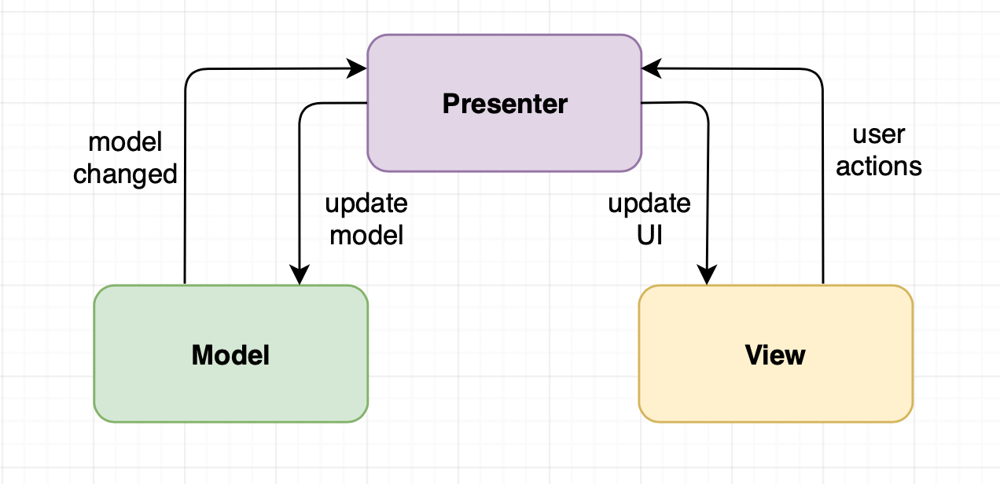

# Qurany
## Under Migrating to Kotlin And MVVM Arch ⚒️ ⚒️
## The development now are continuous in this project
### Qurany : Simple Android Application aims to provide a way for listen to Holy Quran Online over 209 Quran Karim Reciters
## ScreenShot

| Reciters List | Reciter Sura list | Holy Quran Sura audio player | My Reciters List |
| ------ | ----- | ------ | ----- |
|  |  |  |  |


## MVP Archeitecture
* The mvp architecture used in simple way in Qurany as the diagram below shows



## Libraries Used in Qurany
* [AndroidX](https://developer.android.com/jetpack/androidx).
* [Room Persistence](https://developer.android.com/topic/libraries/architecture/room) to store the user reciters.
* [ExoPlayer](https://github.com/google/ExoPlayer) for handle audio player. 
* [Rxjava](https://github.com/ReactiveX/RxJava) for asynchronous tasks.
* [ReactiveNetwork](https://github.com/pwittchen/ReactiveNetwork) for observing/checking internet/network connection
* [Dagger](https://google.github.io/dagger/) for dependency injection.
* [Retrofit](https://square.github.io/retrofit/) and [OkHttp](https://square.github.io/okhttp/) for network connecting .
* [Glide](https://github.com/bumptech/glide) for image loading.
* [Chip Navigation Bar](https://github.com/ismaeldivita/chip-navigation-bar) Bottom Navigation mixed with Chips component.
* [TextPathView](https://github.com/totond/TextPathView) for animated text in splash screen.

## Run the project
* You can run the project directly the API without any fees , full  respect to its owner / owners.
* [Api EndPoint description](https://mp3quran.net/ar/api).

## Testing 
* .....
### License

```
Copyright 2020 Nedal Hasan ABDALLAH

Licensed under the Apache License, Version 2.0 (the "License");
you may not use this file except in compliance with the License.
You may obtain a copy of the License at

http://www.apache.org/licenses/LICENSE-2.0

Unless required by applicable law or agreed to in writing,
software distributed under the License is distributed on an 
"AS IS" BASIS, WITHOUT WARRANTIES OR CONDITIONS OF ANY KIND,
either express or implied. See the License for the specific 
language governing permissions and limitations under the License.

```

